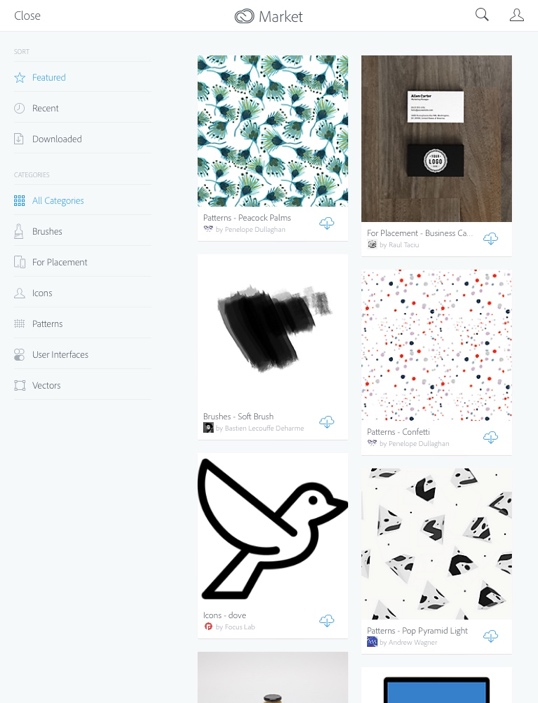
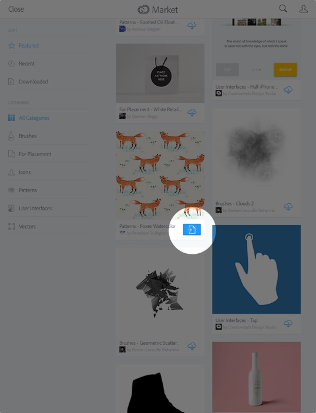

#*Note*: The Creative SDK Market Browser is no longer supported. Adobe will release a new version of the SDK in November 2017, and this component will not be included in the new version. We suggest removing this component from your application as soon as possible to avoid any interruption in service. You can find more information on this deprecation here: [https://creativesdk.zendesk.com/hc/en-us/articles/115004788463-End-of-Support-for-the-Creative-SDK-Image-Editor-UI-Color-UI-Market-Browser-and-Labs-Components](https://creativesdk.zendesk.com/hc/en-us/articles/115004788463-End-of-Support-for-the-Creative-SDK-Image-Editor-UI-Color-UI-Market-Browser-and-Labs-Components)

#Creative Cloud Market UI Component

The Creative Cloud Market is a collection of curated, high quality assets, free for use in applications by any member of the Creative Cloud. Assets include vector graphics, icons, images, and brushes. While these are available from the Creative Cloud application itself, you also can provide Market assets to users of your applications. For instance, a paint program can let your users browse brushes to enhance their creative experience.

The Creative SDK provides a simple way to expose the Market to your users, greatly extending your application.

## Contents

- [Prerequisites](#prerequisites)
- [Integrating the Market UI Component](#integrate)
- [Specifying Content Categories](#contentcategories)
- [Class Reference](#reference)

## Prerequisites

This guide will assume that you have installed all software and completed all of the steps in the following guides:

*   [Getting Started](https://creativesdk.adobe.com/docs/ios/#/articles/gettingstarted/index.html)
*   [Framework Dependencies](https://creativesdk.adobe.com/docs/ios/#/articles/dependencies/index.html) guide.

_**Note:**_

*   _This component requires that the user is **logged in with their Adobe ID**._
*   _Your Client ID must be [approved for **Production Mode** by Adobe](https://creativesdk.zendesk.com/hc/en-us/articles/204601215-How-to-complete-the-Production-Client-ID-Request) before you release your app._

## Integrating the Market UI Component

*You can find the complete "Creative Cloud Market UI Component" project for this guide in <a href="https://github.com/CreativeSDK/ios-getting-started-samples" target="_blank">GitHub</a>.*

The core class our sample application uses is `AdobeUXMarketAssetBrowserViewController`. This class provides a browser to the Market. It gives the user the ability to sort by featured assets, filter by categories, and search:

By default, the Market does not filter what is shown to the user, but the class does let you filter which categories are shown to the user. For example, a painting program may want to limit results to brushes.

When a desired asset is selected, a larger preview is provided by the Market Browser:

In either the grid view or preview, users can download the asset. This copies the asset to their Files on the Creative Cloud (in a **Market Downloads** folder).

Users also can send an asset to the integrating application:

The `AdobeUXMarketAssetBrowserViewController` class provides a way to handle this “open in app” action and lets your action take whatever next steps make sense for it. Let's look at a sample application that makes use of the browser.

The main way you will use the Market browser is by instantiating a new instance of the `AdobeUXMarketAssetBrowserViewController`, specifying a configuration object, if any, specifying a delegate class, and presenting it like a regular UIViewController subclassing using the `presentViewController:animated:completion:` method.

Objective-C:

    AdobeUXMarketBrowserViewController *mbvc = [AdobeUXMarketBrowserViewController marketBrowserViewControllerWithConfiguration:nil
                                                                                                                       delegate:self];
    
    [self presentViewController:mbvc animated:YES completion:nil];

Swift 2:

    let mbvc = AdobeUXMarketBrowserViewController(configuration: nil, delegate: self)
    
    self.presentViewController(mbvc, animated: true, completion: nil)

Specifying a default category, or other configuration properties, is simple too. You can dynamically fetch categories from the API using the categories method of the `AdobeMarketCategory` class, or you can use one of the constants. As an example:

Objective-C:

    AdobeUXMarketBrowserConfiguration *configuration = [AdobeUXMarketBrowserConfiguration new];
    configuration.initialCategory = kMarketAssetsCategoryBrushes;
    
    AdobeUXMarketBrowserViewController *mbvc = [AdobeUXMarketBrowserViewController marketBrowserViewControllerWithConfiguration:configuration
                                                                                                                       delegate:self];
    
    [self presentViewController:mbvc animated:YES completion:nil];

Swift 2:

    let configuration = AdobeUXMarketBrowserConfiguration()
    configuration.initialCategory = kMarketAssetsCategoryBrushes
    
    let mbvc = AdobeUXMarketBrowserViewController(configuration: configuration, delegate: self)
    
    self.presentViewController(mbvc, animated: true, completion: nil)

Once an asset is selected, the `marketBrowserDidSelectAsset` method will be called. This method accepts an argument which is a Market asset. This object can be used to retrieve useful information about the state of the Market asset, as well as, download a rendition (thumbnail).

A simplified except of code that retrieves a thumbnail from a selected Market asset would look something like this:

    [itemSelection downloadRenditionWithDimension:AdobeCommunityAssetImageDimensionWidth
                                             size:CGRectGetWidth(self.selectionThumbnailImageView.frame)
                                             type:AdobeCommunityAssetImageTypePNG
                                         priority:NSOperationQueuePriorityNormal
                                    progressBlock:null
                                     successBlock:^(NSData *imageData, BOOL fromCache)
    {
        UIImage *thumbnail = [UIImage imageWithData:imageData];
        
        if (thumbnail == nil)
        {
            NSLog(@"Could not create a usable UIImage instance from returned data.");
        }
        else
        {
            // Display the thumbnail image
        }
    }
                                cancellationBlock:NULL
                                       errorBlock:^(NSError *error)
    {
        NSLog(@"An error occurred while downloading a thumbnail for the selected Market Asset: %@", error);
    }];

In the code above, we update a label item in our view with information about the asset. A rendition is then requested, and when it completes, an image is updated with the result. Here are two examples:

## Specifying Content Categories

If only certain content categories (types of content) are relevant to your application, you can specify that when you launch the Market component, so your users see only those categories. There are two ways to determine which categories are usable with the Market Browser. First, the `AdobeMarketCategory` class defines the following constants:

    /** The market asset category for "for placement". */
    extern NSString* const kMarketAssetsCategoryForPlacement;

    /** The market asset category for user interfaces. */
    extern NSString* const kMarketAssetsCategoryUserInterfaces;

    /** The market asset category for vector shapes. */
    extern NSString* const kMarketAssetsCategoryVectorShapes;

    /** The market asset category for icons. */
    extern NSString* const kMarketAssetsCategoryIcons;

    /** The market asset category for patterns. */
    extern NSString* const kMarketAssetsCategoryPatterns;

    /** The market asset category for brushes. */
    extern NSString* const kMarketAssetsCategoryBrushes;

You would pass the appropriate constant into the `initialCategory` parameter of the `AdobeUXMarketBrowserConfiguration` instance when setting up the `AdobeUXMarketBrowserViewController` instance.

You also can fetch the latest categories from the network, as well. Using the `categoriesForCommunityID:priority:successBlock:errorBlock` method from AdobeMarketCategory, your code can dynamically fetch both categories and subcategories:

Objective-C

    [AdobeMarketCategory categoriesForCommunityID:[AdobeCommunity market].communityID
                                         priority:NSOperationQueuePriorityNormal
                                     successBlock:^(NSArray *categories)
    {
        for (AdobeMarketCategory *category in categories)
        {
            NSLog(@"Name: %@\n\tSubcategories: %@", category.name, category.subCategories);
        }
    }
                                       errorBlock:^(NSError *error)
    {
        NSLog(@"There was a problem while retrieving categories: %@", error);
    }];

Swift 2

    AdobeMarketCategory.categoriesForCommunityID(AdobeCommunity.market().communityID,
                                                 priority: .Normal,
                                                 successBlock:
        {
            (categories: [AnyObject]!) in
            
            categories.forEach { (object: AnyObject) in
                
                // Note that the actual subclass for `object` is AdobeMarketCategory but a bug 
                // in Swift prevents the compiler from see that type as a subclass of 
                // AdobeCommunityCategory, hence the cast to AdobeCommunitCategory instead of 
                // AdobeMarketCategory.
                let category = object as? AdobeCommunityCategory
                
                print("Name: \(category?.name)\nSubcategories: \(category?.subCategories)\n\n")
            }
        },
                                                 errorBlock:
        {
            (error: NSError!) in
            
            print("There was a problem while retrieving categories: %@", error);
        }
    )

This data could be fetched and then cached in your application, to provide more control over which assets are displayed in the browser.

## Class Reference

+ [AdobeMarketAsset](/Classes/AdobeMarketAsset.html)
+ [AdobeMarketCategory](/Classes/AdobeMarketCategory.html)
+ [AdobeUXMarketAssetBrowser](/Classes/AdobeUXMarketAssetBrowser.html) 

