# AdobeCreativeSDKLabs.framework

The AdobeCreativeSDKLabs.framework (or Labs Framework) contains some of the hottest new technologies straight out of Adobe Labs.  The Labs framework provides the following technologies:

- AdobeLabsMagicAudioSpeechMatcher - allows you to match the acoustic properties of speech recordings
- AdobeLabsMagicCropper - generates automatic crops of various sizes and aspect ratios on images
- AdobeLabsMagicCurve - generates curves and shapes using control points that sit on the curve directly
- AdobeLabsMagicPath - provides an artist-like way to sketch out and generate beautiful paths
- AdobeLabsUXMagicPerspectiveView - automatically manipulates and corrects perspective in an image
- AdobeLabsUXMagicSelectionView - allows for selection and extraction of foreground objects from an image
- **New:** AdobeLabsMagicVectorizer - converts a raster UIImage into a UIBezierCurve
- **New:** MagicDepthMapper - creates a depth map from a UIImage
- **New:** MagicCutoutMaker - automatically cuts out salient portions of an image
- **New:** MagicBrush - simulate real world objects like crayons and play-doh as brushes
- **New:** MagicStyle - make one image match the style of another image

**Disclaimer:** This Adobe Labs framework is a beta product, and is provided with very limited support. As with all of our SDKs, feedback is welcome.

*You can find the complete sample project for this guide in <a href="https://github.com/CreativeSDK/ios-getting-started-samples" target="_blank">GitHub</a>.*

## Contents

- [Prerequisites](#prerequisites)
- [Project Setup](#setup)
- [MagicAudioSpeechMatcher](#magicaudiospeechmatcher)
- [MagicCropper](#magicropper)
- [MagicCurve](#magiccurve)
- [MagicPath](#magicpath)
- [MagicPerspectiveView](#magicperspectiveview)
- [MagicSelectionView](#magicselectionview)
- [**New:** MagicVectorizer](#magicvectorizer)
- [**New:** MagicDepthMapper](#magicdepthmapper)
- [**New:** MagicCutoutMaker](#magiccutoutmaker)
- [**New:** MagicBrush](#magicbrush)
- [**New:** MagicStyle](#magicstyle)
- [Class Reference](#reference)

## Prerequisites

This guide will assume that you have installed all software and completed all of the steps in the following guides:

*   [Getting Started](https://creativesdk.adobe.com/docs/ios/#/articles/gettingstarted/index.html)
*   [Framework Dependencies](https://creativesdk.adobe.com/docs/ios/#/articles/dependencies/index.html) guide.

_**Note:**_

*   _This component requires that the user is **logged in with their Adobe ID**._
*   _Your Client ID must be [approved for **Production Mode** by Adobe](https://creativesdk.zendesk.com/hc/en-us/articles/204601215-How-to-complete-the-Production-Client-ID-Request) before you release your app._

## Project Setup
1. From the application project's Build Phases:
   + Add `AdobeCreativeSDKLabs.framework`, `AdobeCreativeSDKCore.framework`, and several dependent frameworks (see the screenshot below) to **Link Binary With Libraries**.
   + Add `AdobeCreativeSDKCoreResources.bundle` and `AdobeCreativeSDKLabsResources.bundle` to **Copy Bundle Resources**. 
2. Specify an iOS Deployment Target of **8.1** or greater (note the image below specifies 8.0; you should use **8.1** or greater):  
3. Add the **-ObjC** Other Linker Flag: 

## MagicAudioSpeechMatcher

The `AdobeLabsMagicAudioSpeechMatcher` class provides the magical capability to transform speech audio files so that they match the acoustic properties of one or more target speech audio files.  

`AdobeLabsMagicAudioSpeechMatcher` is useful for transforming speech files so that they all sound like they were recorded in the same session, independent of location or microphone position. 

To match one speech file to another, simply create an AdobeLabsMagicAudioSpeechMatcher instance, add one or more target audio files as match targets, and then call matchSpeechOf: to match the speech of the source audio file to the target(s):

    AdobeLabsMagicAudioSpeechMatcher * matcher = [AdobeLabsMagicAudioSpeechMatcher alloc] init];
    AVAsset * sourceAudio =  [AVAsset assetFromURL: sourceURL];
    AVAsset * targetAudio = [AVAsset assetFromURL: targetURL];
    
    [matcher addTarget: targetAudio];
    [matcher matchSpeechOf: sourceAudio
      completionBlock: ^(AVAsset * asset, NSError *error)
      {
          // The asset variable passed into this completion block is a
          // newly generated AVAsset of the sourceAudio with its
          // acoustic properties matched to the target audio file(s)
      }];

It's really easy to make all of your speech recordings sound uniform and professional!

The sample app gives a simple example of matching a noisy audio file to a clear audio file and a clear audio file to a noisy audio file:

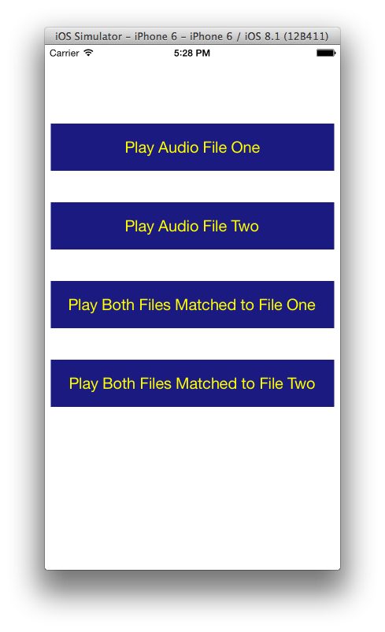

If you wish to hear the results from the sample app that were generated using `AdobeLabsMagicAudioSpeechMatcher` you can click on the following links:

[1.  Play Audio File One](audioFile1.mp3) 
[2.  Play Audio File Two](audioFile2.mp3) 
[3.  Play Both Files Matched To File One](bothFilesMatchedToFile1.mp3) 
[4.  Play Both Files Matched To File Two](bothFilesMatchedToFile2.mp3) 

For more information see the [AdobeLabsMagicAudioSpeechMatcher class reference.](/Classes/AdobeLabsMagicAudioSpeechMatcher.html)

## MagicCropper
The `AdobeLabsMagicCropper` class provides an intuitive way to automatically generate intelligent crop rectangles from a source rectangle. 

To generate crops, first create an AdobeLabsMagicCropper object:

	AdobeLabsMagicPath * magicCropper = [[AdobeLabsMagicCropper alloc] init]];

Then, parameterize the Magic Cropper with a UIImage:

	magicCropper.image = myImage;
	
Now you are ready to generate automatic crops.  Simply call generateCrops to generate crops at the default set of aspect ratios and sizes:

	[magicCropper generateCrops];

Or, a specified set of aspect ratios can be specified:

	[magicCropper generateCrops: @[@(16.0/9.0), @(4.0/3.0)]];

Once the crops are generated, the top N crop results can be retrieved:

	NSArray * results = [magicCropper getTopCropResults: 10];

The results are returned in an NSArray of AdobeLabsMagicCropResult objects.  These objects contain the crop rectangle and various weighted scores.  For more information see the [AdobeLabsMagicCropper class reference.](/Classes/AdobeLabsMagicCropper.html)

## MagicCurve

The `AdobeLabsMagicCurve` class provides an intuitive easy way to generate curves and shapes by adding control points that, unlike traditional Bezier curves, sit on the curve directly.  When the control points are adjusted, the curve magically transforms according to human perceptual expectation. 

To create a curve, simply instantiate it and add its control points:

	AdobeLabsMagicCurve * square = [[AdobeLabsMagicCurve alloc] init];
    [square addControlPoint: CGPointMake(  0,   0) isCorner: YES];
    [square addControlPoint: CGPointMake(100,   0) isCorner: YES];
    [square addControlPoint: CGPointMake(100, 100) isCorner: YES];
    [square addControlPoint: CGPointMake(  0, 100) isCorner: YES];
    square.isClosed = YES; // closing the curve makes it a closed shape as opposed to an open path

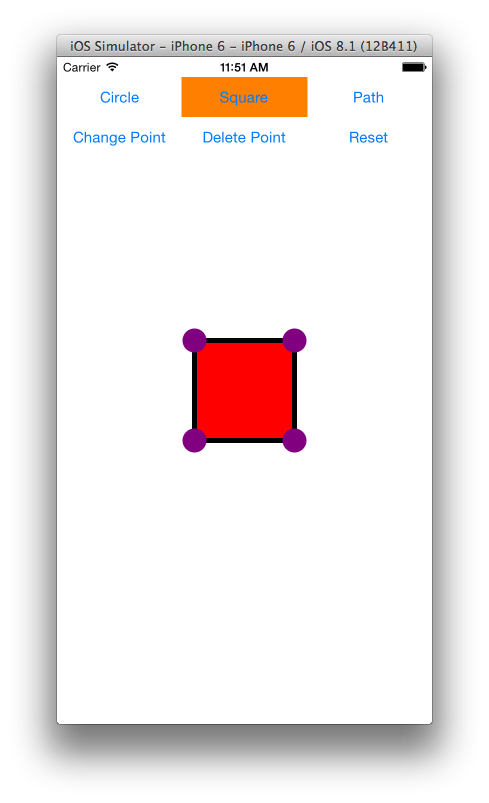

A circle can be made by using the same control point coordinates, but marking them as not corners:

	AdobeLabsMagicCurve * circle = [[AdobeLabsMagicCurve alloc] init];
    [circle addControlPoint: CGPointMake(  0,   0) isCorner: NO];
    [circle addControlPoint: CGPointMake(100,   0) isCorner: NO];
    [circle addControlPoint: CGPointMake(100, 100) isCorner: NO];
    [circle addControlPoint: CGPointMake(  0, 100) isCorner: NO];
    circle.isClosed = YES;

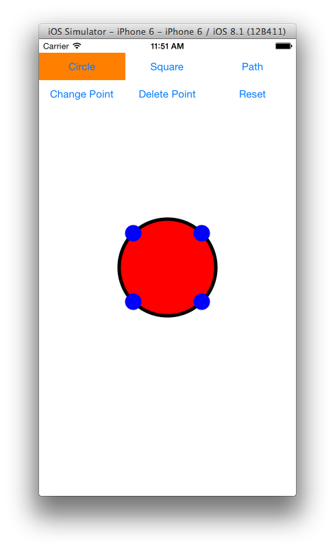

An open path can be made by marking the curve open instead of closed:

	AdobeLabsMagicCurve * path = [[AdobeLabsMagicCurve alloc] init];
    [path addControlPoint: CGPointMake(  0,   0) isCorner: NO];
    [path addControlPoint: CGPointMake(100,  50) isCorner: NO];
    [path addControlPoint: CGPointMake(  0, 150) isCorner: NO];
    [path addControlPoint: CGPointMake(100, 200) isCorner: NO];
    path.isOpen = YES;

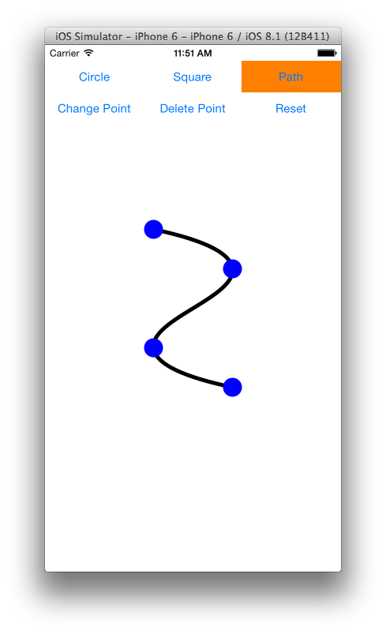

 
`AdobeLabsMagicCurve` also lets you move control points, add and delete control points and change whether or not a control point is a corner.  Here's a circle that has been turned into a PacMan by adding control points and turning three of them into corners:

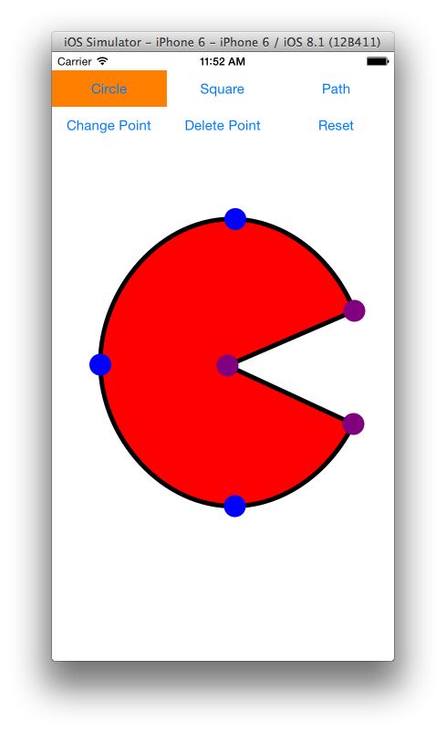

For more information see the [AdobeLabsMagicCurve class reference.](/Classes/AdobeLabsMagicCurve.html)

## MagicPath

The `AdobeLabsMagicPath` class provides an intuitive way to generate and progressively manipulate a path. The first path sets the MagicPath and each path created after the first one manipulates the MagicPath either by extending it from the end points or by modifying an internal part of the MagicPath, both of which are done auto-magically based on the input path. CurrentPath is the path that is intended to edit the magic path once it is ended. MagicPath is build by succesively beginning, moving (hence populating), and ending current paths. 

To create a path, first initiate it:

	AdobeLabsMagicPath * magicPath = [[AdobeLabsMagicPath alloc] init]];

Then, begin a CurrentPath with a `CGPoint`. Such as the following example, where the `CGPoint` is gathered in the `touchesBegan` method of a View object (`PathView` in the sample project).:

	UITouch *touch = [touches anyObject];
    CGPoint currentPoint = [touch locationInView:self];
    [magicPath beginCurrentPath:currentPoint];

To populate (i.e. add more points to) the current path use the `moveCurrentPath` method. In the following example, the `CGPoint` is gathered in the `touchesMoved` method of a View object:

	UITouch *touch = [touches anyObject];
    CGPoint currentPoint = [touch locationInView:self];
    [magicPath moveCurrentPath:currentPoint];

To end the current path, use the `endCurrentPath` method, by also inserting a final point into the current path. In the following example, `CGPoint` is gathered in the `touchesEnded` method of a View object:

	UITouch *touch = [touches anyObject];
    CGPoint currentPoint = [touch locationInView:self];
    [magicPath endCurrentPath:currentPoint];

Once the current path has ended, `AdobeLabsMagicPath` beautifies the set of points in the CurrentPath and manipulates the MagicPath. The first current path that is ended initiates the magic path. Each successive current path that has begun, moved and ended manipulates the magic path by either extending it from the end points or by modifying an internal part of it.

In the following snapshots, Dark red is the current path, and green is the magic path.

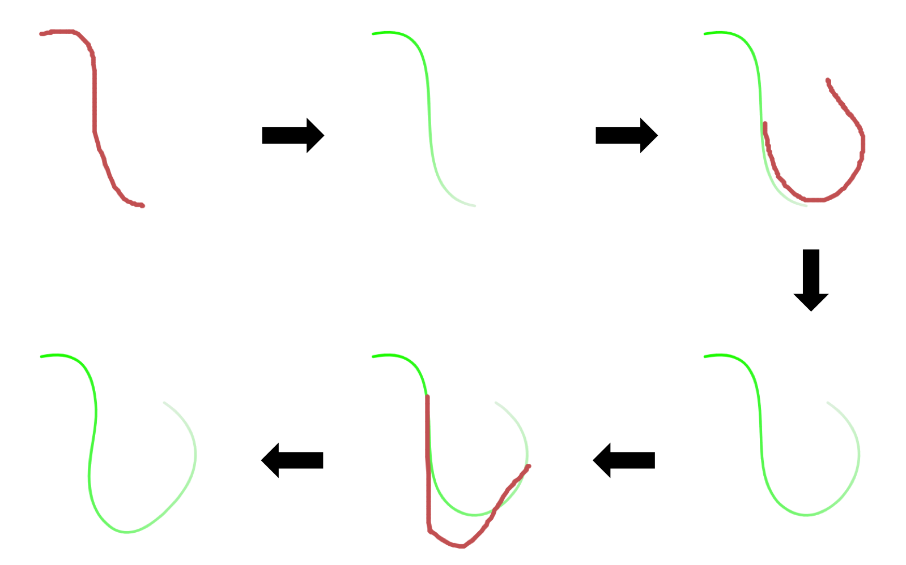

The MagicPath is a set of points that represent a beautified and smooth path, which always preserves its parametrization in the expected order following the its initializing current path (note the bright to pale gradient color of the magic path in the above snapshots).

For more information see the [AdobeLabsMagicPath class reference.](/Classes/AdobeLabsMagicPath.html)

## MagicPerspectiveView

The `AdobeLabsUXMagicPerspectiveView` class allows you to alter the perspective of an image.  It is similar to a combination of UIScrollView and UIImageView - it will display an image and let you scroll and pan the image.  Simply instantiate it, add it as a subview to your view, and call setImage: 

	magicPerspectiveView = [[AdobeLabsUXMagicPerspectiveView alloc] initWithFrame: self.view.bounds];
	[magicPerspectiveView setImage: myImage withCompletionBlock: myCompletionBlock];
	[self.view addSubview: magicPerspectiveView];

<dl><dd><i>Note: setImage is asynchronous and requires the use of a completionBlock for robust operation.  See the sample app (link below) for details.</i></dd></dl>

Once the image is set, the magic perspective view displays the image:

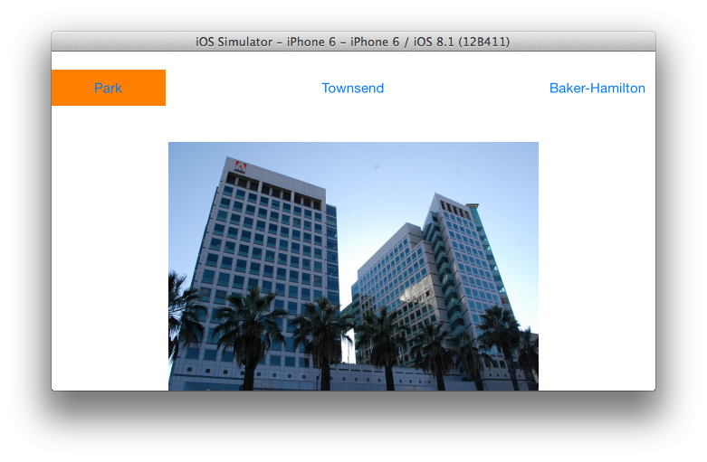

When the completionBlock is called, the image is ready for perspective transformation and may have its perspective transformed by the perspective view in a variety of ways.  Let's use Rectify mode:

	magicPerspectiveView.mode = AdobeLabsMagicPerspectiveModeRectify;
	

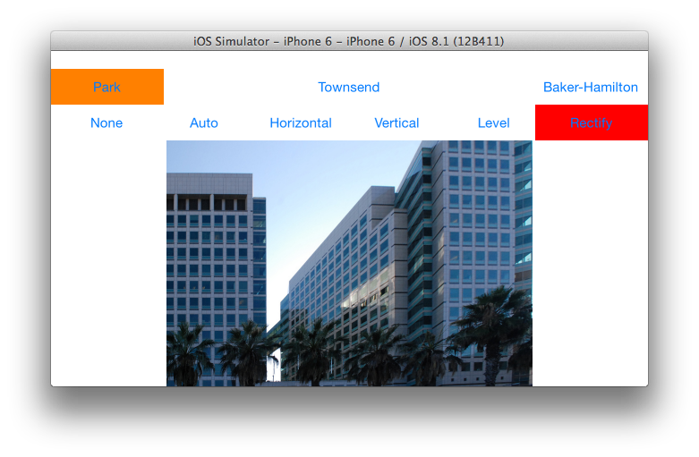

And that's it!  The image is rectified! (And shown zoomed in a bit). 

The `AdobeLabsMagicPerspectiveView` also allows you to retrieve a new UIImage with the perspective transformation by simply reading the image property of the view after applying the mode you want.

For more information see the [AdobeLabsUXMagicPerspectiveView class reference.](/Classes/AdobeLabsUXMagicPerspectiveView.html)

## MagicSelectionView

The `AdobeLabsUXMagicSelectionView` class allows you to automatically select foreground objects from an image and extract them.  The view has characteristics of both `UIScrollView` and `UIImageView`: it displays an image and lets you scroll and pan the image. You instantiate it, add it as a subview to your view, and call `setImage`:

    magicSelectionView = [[AdobeLabsUXMagicSelectionView alloc] 
      initWithFrame: self.view.bounds];
         [magicSelectionView setImage: myImage withCompletionBlock: myCompletionBlock];
         [self.view addSubview: magicSelectionView];

`setImage` is asynchronous and requires the use of a `completionBlock` for robust operation. See the [sample application](/downloads.html) for details.

Once the image is set, the magic selection view is ready to use. Here is the initial display of an image in magic-selection view:

Unlike with `UIScrollView`, here panning is done with two fingers. With magic-selection view, the single-finger gesture is for painting a magic selection:

Once the selection is painted, you can extract the selected foreground from the image:

For more information see the [AdobeLabsUXMagicSelectionView class reference.](/Classes/AdobeLabsUXMagicSelectionView.html)

## MagicVectorizer

 `AdobeLabsMagicVectorizer` is a single channel vectorizer.
  It turns an image into a cubic bezier path of outlines.
 
Let's select an example UIImage that we will convert to a UIBezierPath:

	UIImage * sourceImage = [UIImage imageNamed: @"myImage.jpg"];

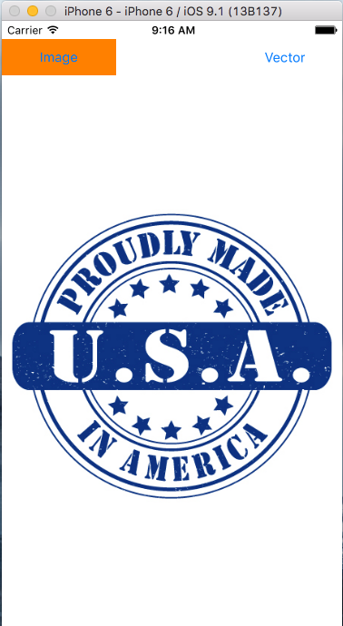

 
Now to vectorize, simply create an AdobeLabsMagicVectorizer instance, parameterize it, and instruct it to vectorize:

	AdobeLabsMagicVectorizer * magicVectorizer = [[AdobeLabsMagicVectorizer alloc] init];
	
	magicVectorizer.smoothing = 0.75;		// 0.0 - 4.0, default 1.0
	magicVectorizer.downsampling = 0;		// 0 - 4, default 1
	magicVectorizer.makeBezierCurves = NO;	// default YES, NO 	means create line segments
	magicVectorizer.iso = 148;				// 1 - 254, default 127
	
	UIBezierPath * vectorizedPath = [magicVectorizer vectorize: sourceImage];

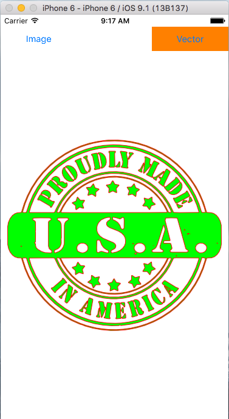

For more information see the [AdobeLabsMagicVectorizer class reference.](/Classes/AdobeLabsMagicVectorizer.html)

## MagicDepthMapper

The `AdobeLabsMagicDepthMapper` class allows for the generation of a visual depth map from an image.

The depth map generated by `AdobeLabsMagicDepthMapper` can be used for various image editing applications, for example in the use of depth-of-field effects.

Let's select an example image we will use:

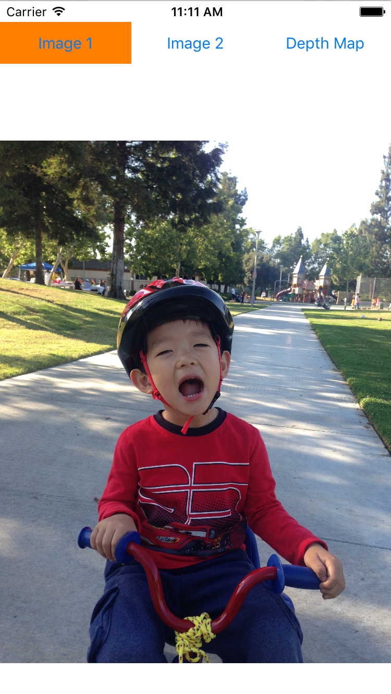

 
Now, to compute the grayscale depth map, simply instantiate a MagicDepthMapper and call estimateDepthMap:

    AdobeLabsMagicDepthMapper * magicDepthMapper = [][AdobeLabsMagicDepthMapper alloc] init];
    UIImage * sourceImage = [UIImage imageNamed: @"sourceImage"];
    [magicDepthMapper estimateDepthMap: sourceImage withCompletionBlock: ^(NSError * error) {
    	if (error == nil) {
			UIImage * grayscaleDepthMap = [magicCutoutMaker getDepthMap];
		}
	}];

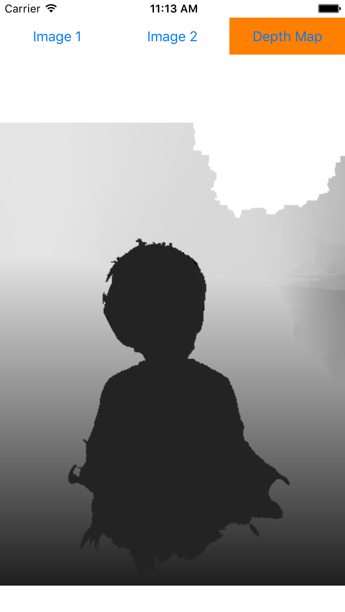

For more information see the [AdobeLabsMagicDepthMapper class reference.](/Classes/AdobeLabsMagicDepthMapper.html)

## MagicCutoutMaker

The `AdobeLabsMagicCutoutMaker` class allows for the generation of a visual saliency map and a foreground object mask from an image.

The saliency map generated by `AdobeLabsMagicCutoutMaker` can be used for various image and video processing and editing applications, and the resulting foreground segmentation mask can be used as initialization for further refinement or re-composition of photos.

Let's select an example image we will use:

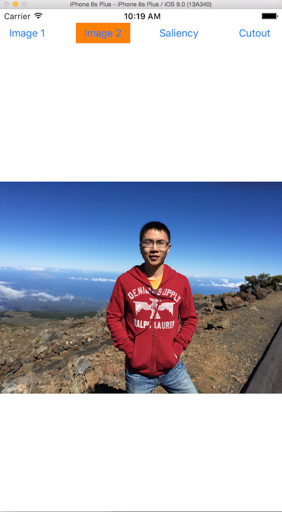

 
Now, to compute the grayscale saliency map, simply instantiate a MagicCutoutMaker and call estimateSaliency:

    AdobeLabsMagicCutoutMaker * magicCutoutMaker = [][AdobeLabsMagicCutoutMaker alloc] init];
    UIImage * sourceImage = [UIImage imageNamed: @"sourceImage"];
    [magicCutoutMaker estimateSaliency: sourceImage withCompletionBlock: ^(NSError * error) {
    	if (error == nil) {
			UIImage * grayscaleSaliencyMap = [magicCutoutMaker getOutput];
		}
	}];

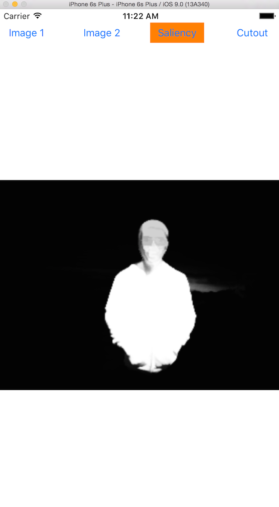

 
To compute the bi-level cutout mask, call estimateCutout:
        
	[magicCutoutMaker estimateCutout: myImage withCompletionBlock: ^(NSError * error) {
		if (error == nil) {
			UIImage * biLevelCutout = [magicCutoutMaker getOutput];
		}
    }];
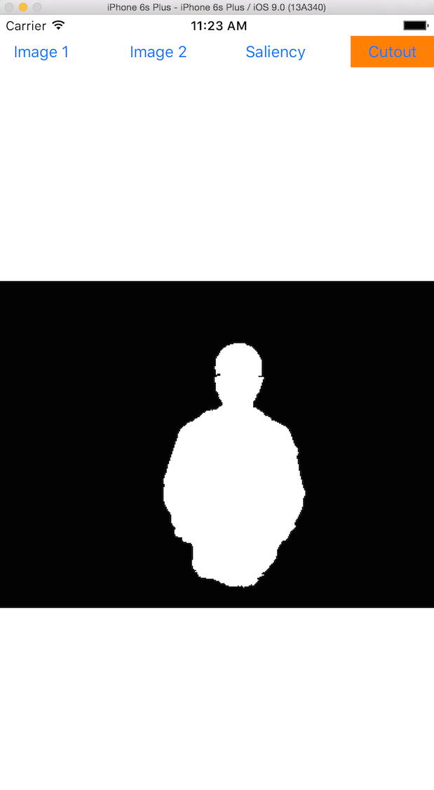

For more information see the [AdobeLabsMagicCutoutMaker class reference.](/Classes/AdobeLabsMagicCutoutMaker.html)

## MagicBrush

The `AdobeLabsMagicBrush` class provides four natural media brushes, watercolor, oil, pastel and playdoh for the user to paint with. Given an input path, `AdobeLabsMagicBrush` generates a textured stroke that resembles the appearance of one of the four natural media. In order to use `AdobeLabsMagicBrush`, `GLKit.framework` needs to be properly linked to your xcode project (Build Phases->Link Binary With Libraries).

To create a brush, simply initiate it with the desirable canvas size. All strokes painted thereafter will be composited into the same canvas. And then select one of the four supported media, indicate the stroke thickness (# pixels) and color (UIColor).

	AdobeLabsMagicBrush * magicBrush = [[AdobeLabsMagicBrush alloc] initWithCanvasSize:canvasSize];
	[magicBrush setBrushType:AdobeLabsMagicBrushWatercolor];
	[magicBrush setBrushThickness:thickness];
	[magicBrush setBrushColor:color];

`AdobeLabsMagicBrush` takes a sequence of `CGPoint` as input to generate a textured stroke. To start a new stroke, call `beginStroke` method as in the following example, where the `CGPoint` is gathered in the `touchesBegan` method of a View object (`BrushView` in the sample project).:

	UITouch *touch = [touches anyObject];
    CGPoint currentPoint = [touch locationInView:self];
    [magicBrush beginStroke:currentPoint];

To populate (i.e. add more points to) the current stroke, use the `moveStroke` method. In the following example, the `CGPoint` is gathered in the `touchesMoved` method of a View object:

	UITouch *touch = [touches anyObject];
    CGPoint currentPoint = [touch locationInView:self];
    [magicBrush moveStroke:currentPoint];

To end the current stroke, use the `endStroke` method to insert a final point. In the following example, `CGPoint` is gathered in the `touchesEnded` method of a View object:

	UITouch *touch = [touches anyObject];
    CGPoint currentPoint = [touch locationInView:self];
    [magicBrush endStroke:currentPoint];

As the user draws, `AdobeLabsMagicBrush` continuously renders the strokes into the underlying canvas. At any point in time, one can retrieve the canvas or the current stroke into a four-channel `UIImage` as follows:

	UIImage *currentCanvas = [magicBrush canvas];
    UIImage *currentStroke = [magicBrush currentStroke];

The `UIImage` for the `currentStroke` contains a subregion of the canvas bounding the current stroke drawn so far. Note that the origin and size of the subregion change continuously as the user draws. The origin of the subregion can be obtained as follows:

	CGPoint strokeOrigin = [magicBrush currentStrokeLocation];
     
At any time, the canvas can be cleared via the following method:

	[magicBrush clearCanvas];
	
The following screenshot from the sample app `magicbrusher` shows some example strokes created by `AdobeLabsMagicBrush`. From left to right, the stroke was created with watercolor, oil, pastel and playdoh.

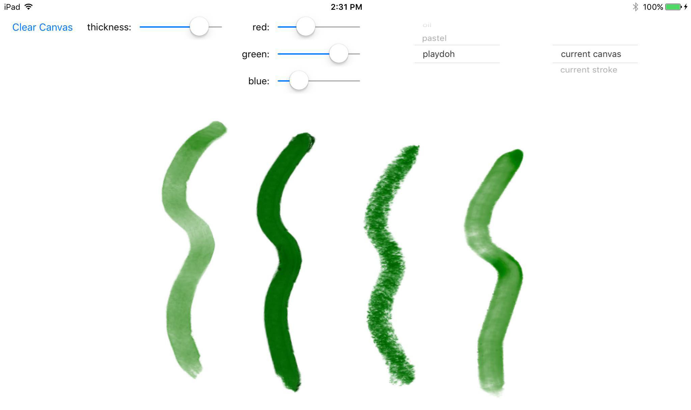

For more information see the [AdobeLabsMagicBrush class reference.](/Classes/AdobeLabsMagicBrush.html)

## MagicStyle

The `AdobeLabsMagicStyle` class provides an automatic way of transferring the photographic style -- more specifically the color palette, contrast, and tone -- of an image to another image. It extracts the style of a reference photograph and applies that style to any other photograph of their choice. Use it to quickly stylize your images by using your favorite photographs as inspiration, or use it to make an entire collection of images match a common color theme!

To use the `AdobeLabsMagicStyle` class, first initialize it as: 

	AdobeLabsMagicStyle *magicStyle = [[AdobeLabsMagicStyle alloc] init]; 
	
Once initialized, the input image to be stylized can be set as:

	UIImage* inputImage = [UIImage imageNamed: inputImageName];
	[magicStyle setInputImage:self.input withCompletionBlock: ^(NSError *error)];
	
This input image can now be stylized using your favorite reference photograph as:

	UIImage *styleImage = [UIImage imageNamed: styleImageName];
    UIImage *resultImage = [magicStyle applyStyleFrom:styleImage];
    	
'resultImage' now stores the edited input image that has been stylized to have the same photographic style as the specified reference image.

The following screenshot from the sample app `magicstyler` shows an example input image stylized `AdobeLabsMagicStyle` using three different reference style images (all shown at the bottom).

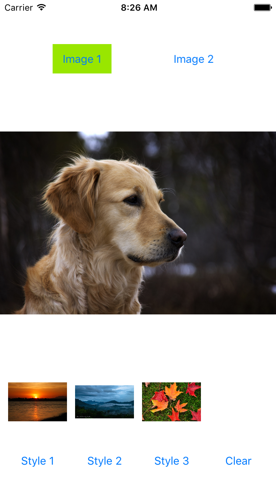  
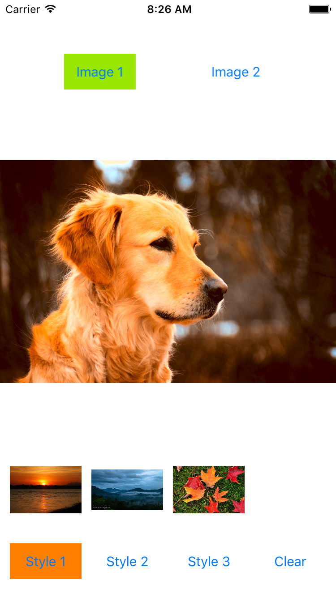
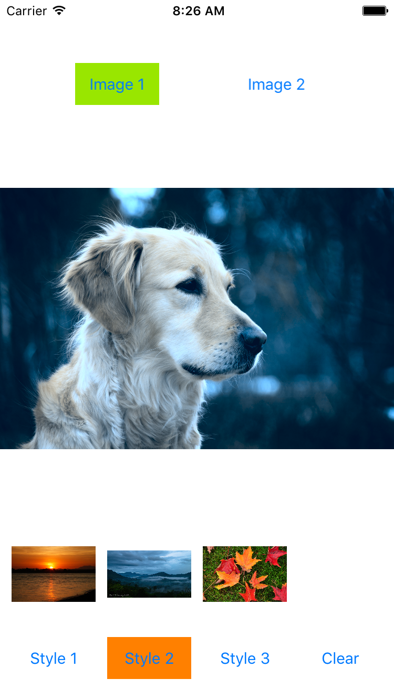
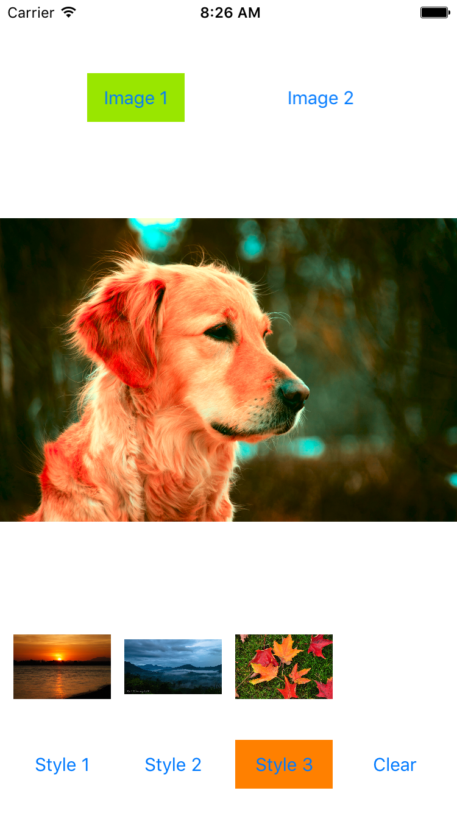
      
For more information see the [AdobeLabsMagicStyle class reference.](/Classes/AdobeLabsMagicStyle.html)

## Class Reference

+ [AdobeLabsMagicAudioSpeechMatcher](/Classes/AdobeLabsMagicAudioSpeechMatcher.html)
+ [AdobeLabsMagicCropper](/Classes/AdobeLabsMagicCropper.html)
+ [AdobeLabsMagicCurve](/Classes/AdobeLabsMagicCurve.html)
+ [AdobeLabsMagicPath](/Classes/AdobeLabsMagicPath.html)
+ [AdobeLabsUXMagicPerspectiveView](/Classes/AdobeLabsUXMagicPerspectiveView.html)
+ [AdobeLabsUXMagicSelectionView](/Classes/AdobeLabsUXMagicSelectionView.html)
+ [**New:** AdobeLabsMagicVectorizer](/Classes/AdobeLabsMagicVectorizer.html)
+ [**New:** AdobeLabsMagicDepthMapper](/Classes/AdobeLabsMagicDepthMapper.html)
+ [**New:** AdobeLabsMagicCutoutMaker](/Classes/AdobeLabsMagicCutoutMaker.html)
+ [**New:** AdobeLabsMagicBrush](/Classes/AdobeLabsMagicBrush.html)
+ [**New:** AdobeLabsMagicStyle](/Classes/AdobeLabsMagicStyle.html)
