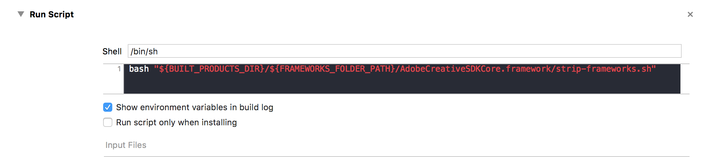
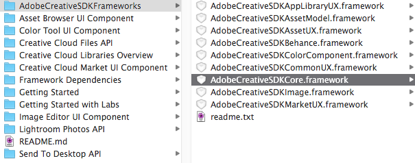
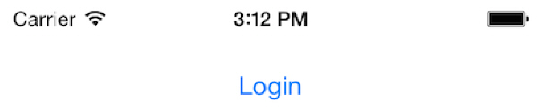

# Getting Started with the iOS Creative SDK

The Creative SDK lets you build applications that integrate with the Creative Cloud and leverage the power of our Creative Cloud offerings to benefit your users. From simply letting them import from and save to their Creative Cloud storage, to using innovative Photoshop APIs via your application, the Creative SDK will help you expand the features of your application by using the Adobe platform.

This guide discusses how to set up the iOS Creative SDK, then steps through a simple tutorial about [Integrating the Authentication Component](#integrating_auth), a necessary part of all Creative SDK workflows.

## Contents

- [Prerequisites](#prerequisites)
- [Registering Your Application](#register_application)
- [Configuring Xcode For Using Dynamic AdobeCreativeSDK Frameworks](#configure-dynamic-framework)
- [Configuring Xcode For Using Static AdobeCreativeSDK Frameworks](#configure-static-framework)
- [Integrating the Authentication Component](#integrating_auth)
- [What’s Next?](#whats_next)
- [Explore iOS Creative SDK Documentation](#explore)

## Prerequisites

+ Before you can work with the Creative SDK, you must register your application and get Client ID and Client Secret values. For details, see [Registering Your Application](#register_application). 
+ To get the iOS SDK, go to the [Downloads page](https://creativesdk.adobe.com/downloads.html), download the ZIP files, and extract them to a location you will remember. The ZIP files contain all the frameworks in the Creative SDK. To learn more about each framework, see the [Framework Dependencies](../18_Framework_Dependencies/18_Framework_Dependencies.htm#XREF_98693_Framework)   guide. The classes used in this guide are in the `AdobeCreativeSDKCore.framework` library.

The following software is required:

+ [Xcode](https://developer.apple.com/xcode/) 7 or higher — See  [Configuring Xcode](#configure_xcode).
+ iOS 9.3.5 or higher

## Registering Your Application

To register your application, follow these steps:

1. Sign in. (If needed, register for an account)
2. Go to the My Apps page, [https://creativesdk.adobe.com/myapps.html](https://creativesdk.adobe.com/myapps.html).
3. Click + NEW APPLICATION.
4. Fill out form, then click ADD APPLICATION.

**Important: As part of registering your application, you are given a Client ID and Secret. Write these down and save them. You will need them in the future, and this is the only time you can see them.**

## Configuring Xcode For Using Dynamic AdobeCreativeSDK Frameworks

To use the Creative SDK Dynamic frameworks, make the following Xcode configuration changes:

1. Add embedded binaries:

    + Switch to **General**.
    + Under **Embedded Binaries**.
    + Click the **+** button.
    + Click **Add Other...**
    + From the location where you extracted the main Creative SDK ZIP file, select `AdobeCreativeSDKCore.framework`.
    + Click Open, and the **Choose options for adding these files** window will appear.
    + Under **Destination**, be sure you do _not_ select **Copy items if needed**.
    + Under **Added folders**, select **Create groups**.
    + Click **Finish**.  

2. Run strip-frameworks script:

    + In Build Phases, add a **Run Script** phase and add the below line to run the strip-frameworks script. 
    `bash "${BUILT_PRODUCTS_DIR}/${FRAMEWORKS_FOLDER_PATH}/AdobeCreativeSDKCore.framework/strip-frameworks.sh"`
    
        

3. Add other required linked frameworks and libraries:

    + Back on Build Phases, select Link Binary with Libraries and click the + button.
    + Add the following binaries. Note: use `.dylib` versions of the `.tbd` libraries if you don't use bitcode.
        - `libc++.tbd` 
        - `libsqlite3.tbd`
        - `libz.tbd`
        - `MobileCoreServices.framework`
        - `SystemConfiguration.framework`.

4. Add the Framework Search Path (If necessary):

    In some cases, Xcode might not add the path to the frameworks to the project. In this case you'd have to add the directory where you extracted the SDK frameworks to the Framework Search Path setting in Xcode. To do so, follow these steps:

    + In the Build Settings of the primary target for your project, locate the **Framework Search Paths** setting under **Search Paths**.
    + Double click the, potentially empty, value to add the path.
    + Click the plus icon at the bottom.
    + Now enter the relative or absolute path to the directory where you uncompressed the CSDK frameworks.
    + Choose **non-recursive**  

Your setup is done. Now you can open any of your project files and import the framework:

    #import <AdobeCreativeSDKCore/AdobeCreativeSDKCore.h>

If Xcode does not auto-complete the framework name, check the setup steps above to ensure you did everything necessary. Specifically check the Framework Search Path step.

## Configuring Xcode For Using Static AdobeCreativeSDK Frameworks

To use the Creative SDK static frameworks, make the following Xcode configuration changes:

1. Add linker flags:

    + Select Build Settings -> Linking -> Other Linker Flags. (If you do not see this setting, see if Basic is selected in Xcode and click All instead.)
    + Double-click the empty area to the right. An empty window pops up for you to add or delete values.
    + Click the + (plus sign) button, and add a new value, `-ObjC`:     
    
    After the new value is added, the Other Linker Flags area of the screen looks like this:     

2. Copy bundle resources:

    + Switch to **Build Phases**.
    + Expand **Copy Bundle Resources**.
    + Click the **+** button.
    + Click **Add Other...**
    + From the location where you extracted the main Creative SDK ZIP file, open `AdobeCreativeSDKCore.framework` -> `Resources` , then select `AdobeCreativeSDKCoreResources.bundle`:     
    + Click Open, and the **Choose options for adding these files** window will appear:    
    + Under **Destination**, be sure you do _not_ select **Copy items if needed**.
    + Under **Added folders**, select **Create groups**.
    + Click **Finish**.  

3. Link binary with libraries:

    + Back on Build Phases, select Link Binary with Libraries and click the + button.
    + Click **Add Other...**
    + Go to where you unzipped the framework, and select the `AdobeCreativeSDKCore.framework` folder:   
    + Click Open.  

4. Add other required linked frameworks and libraries

    + Back on Build Phases, select Link Binary with Libraries and click the + button.
    + Add these binaries by typing in the "Search" box: `libc++.tbd` , `libz.tbd`,  `MobileCoreServices.framework` and `SystemConfiguration.framework`. Use the `.dylib` version of the `.tbd` libraries if you don't have Bitcode enabled for your project.

    This is what the Link Binary With Libraries section should look like after you've added all the required frameworks:    
    
5. Add the Framework Search Path (If necessary):

    In some cases, Xcode might not add the path to the frameworks to the project. In this case you'd have to add the directory where you extracted the SDK frameworks to the Framework Search Path setting in Xcode. To do so, follow these steps:
    
    + In the Build Settings of the primary target for your project, locate the **Framework Search Paths** setting under **Search Paths**.
    + Double click the, potentially empty, value to add the path.
    + Click the plus icon at the bottom.
    + Now enter the relative or absolute path to the directory where you uncompressed the CSDK frameworks.
    + Choose **non-recursive**  

Your setup is done. Now you can open any of your project files and import the framework:

    #import <AdobeCreativeSDKCore/AdobeCreativeSDKCore.h>

If Xcode does not auto-complete the framework name, check the setup steps above to ensure you did everything necessary. Specifically check the Framework Search Path step.

## Integrating the Authentication Component

*You can find the complete code for this guide in <a href="https://github.com/CreativeSDK/ios-getting-started-samples" target="_blank">GitHub</a>.*

Authentication is part of every Creative SDK workflow and every action performed requires a logged-in user. Fortunately, using the Authentication component is easy. The first thing we need to do is to specify the client ID and secret values for our app from the registration site.

We set up our client ID and secret by calling the `setAuthenticationParametersWithClientID:clientSecret:additionalScopeList:` method:

Objective-C

    [[AdobeUXAuthManager sharedManager] setAuthenticationParametersWithClientID:kCreativeSDKClientId
                                                                   clientSecret:kCreativeSDKClientSecret
                                                            additionalScopeList:@[AdobeAuthManagerUserProfileScope, 
                                                                                  AdobeAuthManagerEmailScope, 
                                                                                  AdobeAuthManagerAddressScope]];

Swift 2

    AdobeUXAuthManager.sharedManager().setAuthenticationParametersWithClientID(kCreativeSDKClientId,
                                                                               clientSecret: kCreativeSDKClientSecret,
                                                                               additionalScopeList: [AdobeAuthManagerUserProfileScope, 
                                                                                                     AdobeAuthManagerEmailScope, 
                                                                                                     AdobeAuthManagerAddressScope])

We also need to set the redirect URL for app. Note that all of this information, i.e. the client ID, secret and the redirect URL can be retrieved from the app registration portal.

Objective-C

    [AdobeUXAuthManager sharedManager].redirectURL = [NSURL URLWithString:kCreativeSDKRedirectURLString];

Swift 2

    AdobeUXAuthManager.sharedManager().redirectURL = NSURL(string: kCreativeSDKRedirectURLString)

At this point we need to decide whether the user is already authenticated. If the user isn't already authenticated, we'd have to bring up the Authentication component UI which will ask for the user's credentials and handle the actual login process:

Objective-C

    if ([AdobeUXAuthManager sharedManager].isAuthenticated)
    {
        NSLog(@"The user has already been authenticated. User profile: %@", [AdobeUXAuthManager sharedManager].userProfile);
    }
    else
    {
        [[AdobeUXAuthManager sharedManager] login:self 
                                        onSuccess:^(AdobeAuthUserProfile *profile)
        {
            NSLog(@"Successfully logged in. User profile: %@", profile);
            
            ...
        } 
                                         onError:^(NSError *error)
        {
            NSLog(@"There was a problem logging in: %@", error);
        }];
    }

Swift

    if (AdobeUXAuthManager.sharedManager().authenticated)
    {
        print("The user has already been authenticated. User profile: \(AdobeUXAuthManager.sharedManager().userProfile)")
    }
    else
    {
        AdobeUXAuthManager.sharedManager().login(self,
                                                 onSuccess:
            {
                (profile: AdobeAuthUserProfile!) -> Void in
                
                print("Successfully logged in. User profile: \(profile)")
                
                ...
            },
                                                 onError:
            {
                (error: NSError!) -> Void in
                
                print("There was a problem logging in: \(error)")
            }
        )
    }

When the user clicks the Login button, the SDK takes over:   

The user can login or create a Creative Cloud account, via the SDK.

In addition, the SDK caches the login for approximately 14 days, which means on future visits during that period, users do not have to login again. If you return to the `viewDidLoad` method, note that we check for this and handle updating the button, and the name and email labels. We also log the userProfile for the logged-in user to console:   

## What’s Next?

### Submit Your Application for Review

Adobe must review all applications that use the Creative SDK before they are released. See the guidelines in  [Using the Creative Cloud Badge and Brand](https://creativesdk.adobe.com/docs/ios/#/brandguidelines/index.html)   and the [terms of use](http://wwwimages.adobe.com/content/dam/Adobe/en/legal/servicetou/Creative_SDK-en_US.pdf) . Instructions for submitting your app for review are [here](https://creativesdk.zendesk.com/hc/en-us/articles/204601215-How-to-complete-the-Production-Client-ID-Request).

### Troubleshooting and Support

Articles about common issues are at [help.creativesdk.com](http://help.creativesdk.com), along with a place to submit tickets for bugs, feature requests, and general feedback.

## Explore iOS Creative SDK Documentation

Now check out the rest of the Creative SDK documentation:

### Creative Cloud Content Management 

+ [Asset Browser UI](/articles/assetbrowser/index.html)  
+ [Creative Cloud Files API](/articles/files/index.html)  
+ [Lightroom Photos API](/articles/photos/index.html)  
+ [About Creative Cloud Libraries](/articles/libraries/index.html)

### Creative Cloud Content 

+ [Creative Cloud Market UI](/articles/market/index.html)

### Creative Tools 

+ [Image Editor UI](/articles/imageeditor/index.html)  
+ [Color UI](/articles/color/index.html)  

### Creative Cloud Workflows 

+ [Share Menu UI](/articles/sharemenu/index.html)  
+ [Send To Desktop](/articles/sendtodesktop/index.html)  
+ [Behance Publish UI](/articles/behance/index.html)  

### Adobe Labs 

+ [Magic Selection View](/articles/magicselection/index.html)  

### Frameworks 

+ [Framework Dependencies](/articles/dependancies/index.html) 
