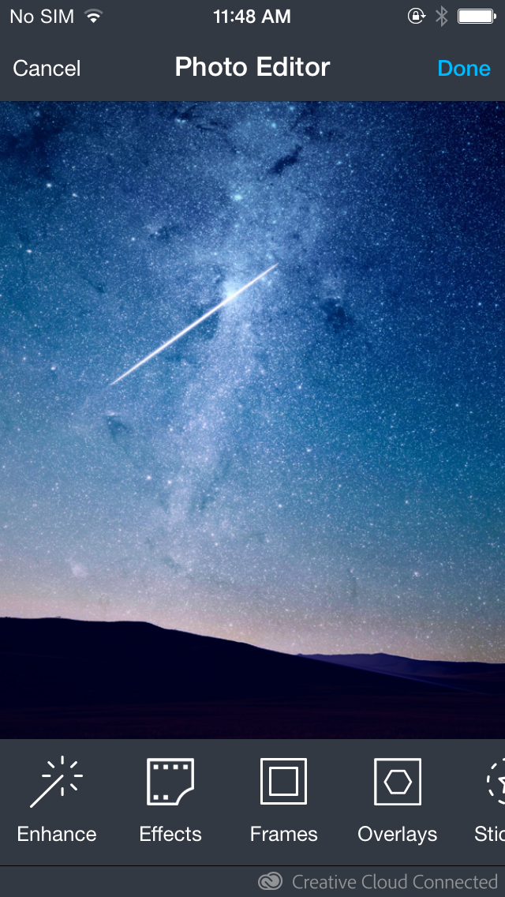

# Image Editor UI Component

The Creative SDK Image component enables developers to add photo editing to their iOS applications. The image editor includes over 20 advanced imaging tools, covering everything from effects and crop to red-eye and blemish. All the tools are GPU-accelerated, so all image modifications happen in real time or close to it. Integrating the image editor into an application typically takes less than 15 minutes of development time.

This guide describes setup and practical use of all components of the Image Editor UI Component.

## Editor

The image editor is in `AdobeUXImageEditorViewController`, a presentable `UIViewController` subclass. The editor provides fast image editing to users and an easy-to-use programmatic interface to developers.

## Prerequisites

This guide will assume that you have installed all software and completed all of the steps in the following guides:

*   [Getting Started](https://creativesdk.adobe.com/docs/ios/#/articles/gettingstarted/index.html)
*   [Framework Dependencies](https://creativesdk.adobe.com/docs/ios/#/articles/dependencies/index.html) guide.

_**Note:**_

*   _This component offers a better experience for users when they log in with their Adobe ID.._
*   _Your Client ID must be [approved for **Production Mode** by Adobe](https://creativesdk.zendesk.com/hc/en-us/articles/204601215-How-to-complete-the-Production-Client-ID-Request) before you release your app._

## Integration

To launch the editor, create and display an instance of `AdobeUXImageEditorViewController`. You can present it modally:

    + (void)displayEditorForImage:(UIImage *)imageToEdit
    {
       AdobeUXImageEditorViewController *editorController = [[AdobeUXImageEditorViewController
         alloc] initWithImage:imageToEdit];
       [editorController setDelegate:self];
       [self presentViewController:editorController animated:YES completion:nil];
    }

You can display the controller in other ways, such as within a `UIPopoverController` or manually adding it to the view hierarchy. If you present the controller in such a way, you are responsible for making sure it receives the standard view-controller lifecycle messages, including `viewWillAppear:`, `viewWillDisappear:`, and so on. The controller may be displayed full-screen or in a smaller portion of the screen. We do not recommend pushing the controller onto a `UINavigationController`'s stack, since the editor itself uses a subclass of `UINavigationController`.

The delegate object you provide to the editor must conform to the `AdobeUXImageEditorViewControllerDelegate` protocol. It should implement the following methods to receive cancellation and completion events from the editor:

    + (void)photoEditor:(AdobeUXImageEditorViewController *)editor finishedWithImage:(UIImage
      *)image
    {
       // Handle the result image here
    }

    + (void)photoEditorCanceled:(AdobeUXImageEditorViewController *)editor
    {
       // Handle cancellation here
    }

You are responsible for dismissing the `AdobeUXImageEditorViewController`.

## Customization

Customization options are provided so the editor's look, feel, and functionality can be made consistent with any application, using the SDK Customer and the `AdobeImageEditorCustomization` class.

### Visual Customization

Most visual customization is done through the SDK Customizer, an OS X application included in the Creative SDK Image directory. Use the **Apply to Xcode Project** button to reflect your changes in integrating the Image component. You can save customization profiles, to transfer them to other people.

### Tool Order

The editor’s default tool order can be changed with the `setToolOrder:` method. The parameter to this method is an array of strings whose values represent the available editor tools. For a complete list of these constants (tools), see the top of the `AdobeImageEditorCustomization.h` file. If a tool is omitted from the array, it will not be shown in the editor.

    // Set the tools to Sticker, Frames, Enhance, and Crop (displayed in that order).
    [AdobeImageEditorCustomization setToolOrder:@[kAFStickers, kAFFrames, 
      kAFEnhance, kAFCrop]];

### Custom Icons and Images  

It is possible to customize the icons that represent the tools inside your application, with the `setIconImage:forTool:` method. The icon image should be roughly 50 points square, with a transparent background. The tool parameter must be one of the constants representing the available tools, listed at the top of `AdobeImageEditorCustomization.h`:

    [AdobeImageEditorCustomization setIconImage:image forTool:kAFBrightness];

It is also possible to set a pattern image for the navigation bar inside the editor, using the `setNavBarImage:` method:

    [AdobeImageEditorCustomization setNavBarImage:image];

### Crop Sizes

The crop tool can be configured to show only the sizes that make sense for your application. There are four methods to customize sizes:

+ `setCropToolCustomEnabled:` determines whether the user can crop with a custom aspect ratio.
+ `setCropToolOriginalEnabled:` determines whether the user is given the preset to crop with the image's original aspect ratio.
+ `setCropToolInvertEnabled:` determines whether the user can invert the crop presets by double tapping:

        // Disable the Custom and Original crop options, and do not allow the user to invert the settings.
        [AdobeImageEditorCustomization setCropToolCustomEnabled:NO];
        [AdobeImageEditorCustomization setCropToolOriginalEnabled:NO];
        [AdobeImageEditorCustomization setCropToolInvertEnabled:NO];

+ `setCropToolPresets:` specifies custom presets. The parameter for this method is an array of dictionaries, each of which must have values for these keys: `kAFCropPresetName` (preset display name), `kAFCropPresetWidth` (preset width), and `kAFCropPresetHeight` (preset height):

        // Create two custom presets displayed to the user as "Option1" and "Option2" with 3:7 and 4:11 aspect ratios, respectively.
        [AdobeImageEditorCustomization setCropToolPresets:@[
            @{kAFCropPresetName:@"Option1", 
            kAFCropPresetWidth:@3, 
            kAFCropPresetHeight:@7}, 
            @{kAFCropPresetName:@"Option2",
            kAFCropPresetWidth:@4, 
            kAFCropPresetHeight:@11}]];

### Mandatory Crop

In some cases, you might want to ensure that the images created in the editor are of a specific aspect ratio. In this case, initialize the `AdobeUXImageEditorViewController` with a call to `initWithImage:mandatoryCropPresets:`. Choose one or more aspect ratios, like in the following example:

    + (void)displayEditorForImage:(UIImage *)imageToEdit
    {
        NSArray<AdobeImageEditorCropPreset *> *presets = @[
            [[AdobeImageEditorCropPreset alloc] initWithName:@"3:2"
                                                       width:3.0f
                                                      height:2.0f],
        ];
        AdobeUXImageEditorViewController *editorController = [[AdobeUXImageEditorViewController
         alloc] initWithImage:imageToEdit mandatoryCropPresets:presets];
        [editorController setDelegate:self];
        [self presentViewController:editorController animated:YES completion:nil];
    }

The above example will ensure an output image that has a 3:2 aspect ratio.

### Supported Interface Orientations

The interface orientations supported by the iPad version of the editor can be customized with the `setSupportedIPadOrientations:` method. (On the iPhone, only the portrait orientation is supported.)

    [AdobeImageEditorCustomization
        setSupportedIpadOrientations:@[@(UIInterfaceOrientationLandscapeLeft),
        @(UIInterfaceOrientationLandscapeRight), @(UIInterfaceOrientationPortrait)]];

### Titles of Cancel and Apply Buttons

If the Cancel and Apply buttons on the main Photo Editor screen are not consistent with your application, you can rename them as follows:

+ **Cancel** can be renamed **Back** or **Exit** 
+ **Apply** can be renamed **Done**, **Save**, **Next**, or **Send** 

    [AdobeImageEditorCustomization
      setLeftNavigationBarButtonTitle:kAFLeftNavigationTitlePresetExit];
    [AdobeImageEditorCustomization
      setRightNavigationBarButtonTitle:kAFRightNavigationTitlePresetSave];

### Content Sync

Users can now log in with their Adobe ID to sync their content, such as content acquired from the Aviary app. This is optional and only available to approved partners.  Interested partner can <a href="https://creativesdk.zendesk.com/hc/en-us/requests/new?ticket_form_id=66896" title="sign up">sign up here</a>!
